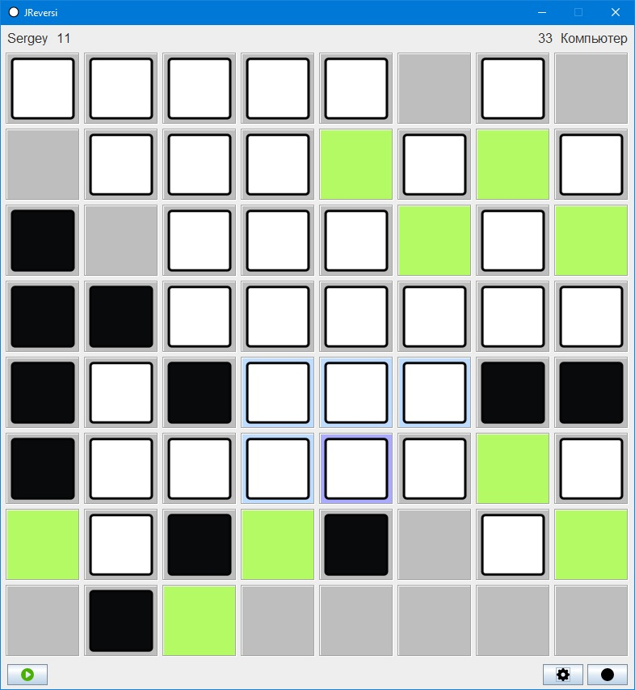

# JReversi
Игра Реверси

Этот проект стал для меня первым проектом, в котором я использовал многопоточность.
Поиск оптимального хода производится компьютером в отдельном потоке.
Также для ускорения поиска хода удалось реализовать алгоритм альфа-бета отсечения.
Ещё во время игры можно менять цвет шашек (с белого на черный и обратно), а также их внешний вид.

